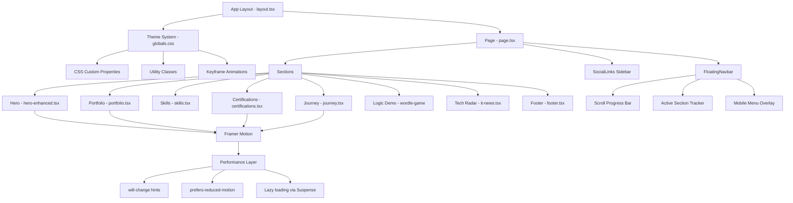
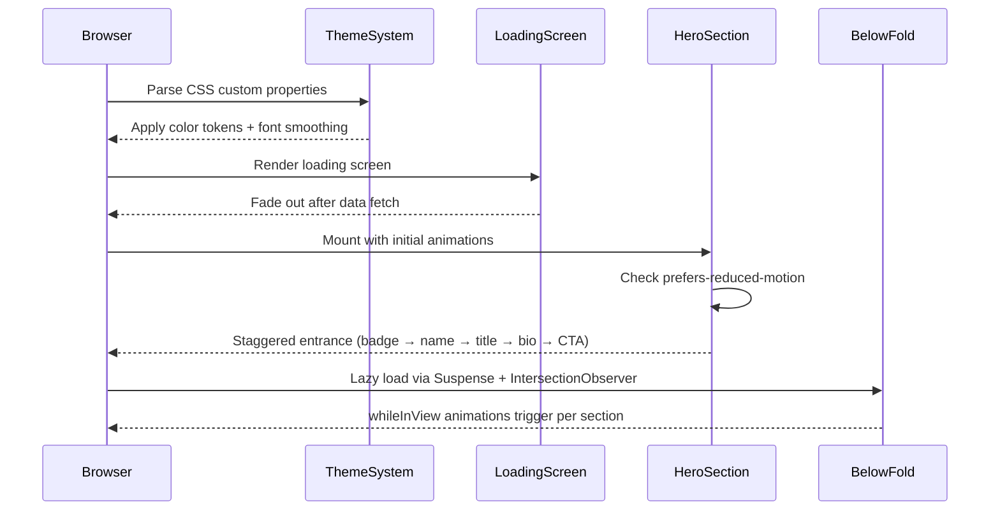

# Design Document: UI Improvements

## Overview

This document covers comprehensive UI/UX improvements for the Next.js 15.3.9 portfolio website. The site already has a strong foundation — glassmorphism cards, Framer Motion animations, 3D parallax in the hero, a floating navbar, matrix rain, and a terminal modal — but several areas need polish: visual consistency across sections, typography hierarchy, responsive behavior on mobile, animation performance, and accessibility.

The improvements are organized into two layers. The high-level design covers component architecture, the color/token system, layout structure, and responsive strategy. The low-level design covers specific Tailwind class changes, animation parameter tuning, component-level code patterns, and typography refinements. No structural rewrites are needed — all changes are additive or targeted replacements within existing components.

The guiding principle is "less is more": reduce visual noise, tighten spacing, improve contrast ratios, and make animations feel intentional rather than decorative.

## Architecture



## Sequence Diagram: Page Load & Animation Flow



## Components and Interfaces

### Component 1: FloatingNavbar

**Purpose**: Persistent navigation that transitions from transparent to glassmorphism on scroll, tracks active section, and provides mobile menu.

**Current Issues**:
- The `width` spring from `"90%"` to `"auto"` causes layout shift on some viewports
- No `aria-current` on active nav items
- Mobile menu lacks focus trap

**Interface**:
```typescript
// No props — reads scroll position and DOM sections internally
export default function FloatingNavbar(): JSX.Element
```

**Improvements**:
- Add `aria-current="page"` to active nav button
- Add `role="navigation"` and `aria-label="Main navigation"`
- Wrap mobile menu in a focus trap (use `focus-trap-react` or manual `onKeyDown` handler)
- Smooth the width transition: replace `useTransform(scrollY, [0, 100], ["90%", "auto"])` with a CSS class toggle to avoid layout jank

### Component 2: HeroEnhanced

**Purpose**: Full-screen hero with 3D parallax, animated name letters, status badge, bio, and CTA buttons.

**Current Issues**:
- Letter-by-letter hover on the name (`whileHover` per `<span>`) causes excessive re-renders on fast mouse movement
- The `textShadow` in `whileHover` is not animatable by Framer Motion (it's a string, not a number) — falls back to instant switch
- Bio text `text-gray-400` at `text-lg` may fail WCAG AA contrast on the dark background
- No `aria-label` on the scroll indicator

**Interface**:
```typescript
interface HeroEnhancedProps {
  name: string
  city?: string
  title: string
  bio: string
  hasResume?: boolean
}
```

**Improvements**:
- Replace per-letter `whileHover` with a CSS `hover:` group approach or throttle the motion values
- Use `filter: drop-shadow()` instead of `textShadow` for animatable glow
- Increase bio text to `text-gray-300` for better contrast
- Add `aria-hidden="true"` to decorative orbs and `aria-label="Scroll down"` to scroll indicator

### Component 3: Skills

**Purpose**: Categorized skill grid with tech logos and category icons.

**Current Issues**:
- Cards use `Card` from shadcn with default border — inconsistent with the `card-ultra` style used in Portfolio/Certifications
- No entrance animation — section appears instantly
- Category icon colors are hardcoded, not using the theme token system

**Improvements**:
- Apply `card-ultra-border` + `card-ultra` wrapper pattern (already defined in globals.css)
- Add `whileInView` stagger animation matching Portfolio/Certifications pattern
- Use CSS custom property `hsl(var(--primary))` for icon colors

### Component 4: Portfolio (ProjectCard)

**Purpose**: Filterable project grid with mouse-tracking spotlight, animated tech tags, and action buttons.

**Current Issues**:
- `useTransform` inside JSX (`style={{ background: useTransform(...) }}`) is called conditionally inside a render — technically valid but creates a new motion value on each render
- Filter buttons have no keyboard focus ring visible in dark theme
- The `gradient-portfolio-line` SVG `id` conflicts if multiple Portfolio instances render

**Improvements**:
- Hoist the `useTransform` for spotlight background to component level (already at component level in `ProjectCard` — verify it's not inside a conditional)
- Add `focus-visible:ring-2 focus-visible:ring-violet-500` to filter buttons
- Suffix SVG gradient IDs with the project index to prevent conflicts

### Component 5: Journey (Timeline)

**Purpose**: Vertical timeline showing grouped work experience and education.

**Current Issues**:
- Timeline line (`absolute left-6`) is clipped on very small screens (< 360px)
- The ping animation on timeline dots runs indefinitely — should respect `prefers-reduced-motion`
- Education section uses `School` icon but no color differentiation from experience section at a glance

**Improvements**:
- Change timeline line to `left-4 md:left-6` for small screen safety
- Wrap ping animation: `@media (prefers-reduced-motion: reduce) { .animate-ping { animation: none } }`
- Add a subtle blue tint to education card backgrounds (`bg-blue-500/[0.02]`) to visually separate from violet experience cards

### Component 6: Certifications (CertificateCard)

**Purpose**: Holographic certification cards with issuer logos, credential IDs, and verify links.

**Current Issues**:
- `animate-spin-slow` on the conic gradient border runs on every card simultaneously — GPU-intensive
- The `useMotionTemplate` spotlight is recalculated on every mouse move without throttling
- Cards have `min-h-[340px]` but no `max-h`, causing height inconsistency in the grid

**Improvements**:
- Lazy-start `animate-spin-slow` only on hover (`group-hover:animate-spin-slow`, remove from default state)
- Add `pointer-events: none` check and throttle mouse move handler with `requestAnimationFrame`
- Set consistent card height with `h-full` on the grid items and `grid-rows` alignment

### Component 7: globals.css Utilities

**Purpose**: Shared animation utilities, glassmorphism classes, card styles, and keyframes.

**Current Issues**:
- `glass-effect` and `glass-morphism` have slightly different `backdrop-filter` values — should be unified
- No `@media (prefers-reduced-motion: reduce)` block for the keyframe animations
- Missing `font-display: swap` hint for custom fonts (if any are loaded)

**Improvements**:
- Add a single `@media (prefers-reduced-motion: reduce)` block that sets `animation-duration: 0.01ms` and `transition-duration: 0.01ms` for all animated elements
- Unify `glass-effect` blur to `backdrop-filter: blur(20px) saturate(180%)`
- Add `scroll-margin-top: 80px` to all section IDs to account for the floating navbar height

## Data Models

### Color Token System

```typescript
// Current tokens in globals.css :root
interface ColorTokens {
  background: "240 10% 4%"      // Deep dark, not pitch black
  foreground: "0 0% 98%"
  primary: "265 80% 60%"        // Electric violet
  accent: "330 85% 60%"         // Vivid rose/magenta
  muted: "240 5% 15%"
  mutedForeground: "240 5% 65%" // ← needs bump to 70%+ for WCAG AA
  border: "240 5% 15%"
  ring: "265 70% 60%"
}

// Proposed additions for semantic consistency
interface SemanticTokens {
  surfaceElevated: "rgba(255,255,255,0.03)"   // card backgrounds
  surfaceHover: "rgba(255,255,255,0.06)"       // hover states
  borderSubtle: "rgba(255,255,255,0.06)"       // default card borders
  borderActive: "rgba(139,92,246,0.30)"        // hover/active borders
  glowPrimary: "rgba(139,92,246,0.20)"         // violet glow
  glowAccent: "rgba(236,72,153,0.15)"          // pink glow
  glowCyan: "rgba(6,182,212,0.15)"             // cyan glow
}
```

### Typography Scale

```typescript
interface TypographyScale {
  // Section headings (Journey, Portfolio, Certifications, Skills)
  sectionHeading: "text-4xl md:text-6xl lg:text-7xl font-black tracking-tight"
  
  // Section subheadings / card titles
  cardTitle: "text-xl md:text-2xl font-bold"
  
  // Body / descriptions
  body: "text-sm md:text-base text-gray-300 leading-relaxed"  // was gray-400
  
  // Metadata / labels
  meta: "text-xs text-gray-500 font-mono"
  
  // Badge / pill labels
  badge: "text-xs font-semibold uppercase tracking-wider"
  
  // Hero name
  heroName: "text-6xl md:text-8xl lg:text-9xl font-bold tracking-tight"
  
  // Hero title
  heroTitle: "text-2xl md:text-4xl font-light"
}
```

### Animation Configuration

```typescript
interface AnimationConfig {
  // Spring presets
  springs: {
    snappy: { stiffness: 400, damping: 30 }       // buttons, badges
    smooth: { stiffness: 200, damping: 30, mass: 2 } // 3D parallax (current)
    gentle: { stiffness: 100, damping: 20 }        // card entrances
  }
  
  // Entrance animation (whileInView)
  entrance: {
    initial: { opacity: 0, y: 20 }
    animate: { opacity: 1, y: 0 }
    transition: { duration: 0.5, ease: [0.25, 1, 0.5, 1] }
  }
  
  // Stagger container
  staggerContainer: {
    hidden: { opacity: 0 }
    visible: {
      opacity: 1
      transition: { staggerChildren: 0.1, delayChildren: 0.2 }
    }
  }
  
  // Hover lift (cards)
  hoverLift: {
    whileHover: { y: -5, transition: { type: "spring", stiffness: 300, damping: 20 } }
  }
}
```

## Algorithmic Pseudocode

### Section Entrance Animation Pattern

```pascal
ALGORITHM applyWhileInViewAnimation(component, delay)
INPUT: component (React element), delay (number, seconds)
OUTPUT: component wrapped with motion.div entrance animation

PRECONDITIONS:
  - component is a valid React element
  - delay >= 0

POSTCONDITIONS:
  - component fades in and slides up when scrolled into viewport
  - animation runs once (viewport: { once: true })
  - respects prefers-reduced-motion via CSS media query

BEGIN
  variants ← {
    hidden: { opacity: 0, y: 20 },
    visible: { opacity: 1, y: 0, transition: { duration: 0.5, delay: delay } }
  }
  
  RETURN motion.div(
    initial: "hidden",
    whileInView: "visible",
    viewport: { once: true, margin: "-50px" },
    variants: variants,
    children: component
  )
END
```

### Active Section Detection

```pascal
ALGORITHM detectActiveSection(navItems, scrollY)
INPUT: navItems (array of { href: string }), scrollY (number)
OUTPUT: activeSection (string — section id)

PRECONDITIONS:
  - navItems is non-empty
  - All href values correspond to existing DOM section IDs
  - scrollY >= 0

POSTCONDITIONS:
  - Returns the section id whose element's bounding rect straddles the 30% viewport threshold
  - Returns previous activeSection if no section matches (no flicker)

LOOP INVARIANT:
  - All previously checked sections did not match the threshold

BEGIN
  threshold ← window.innerHeight * 0.3
  
  FOR each item IN navItems DO
    ASSERT item.href starts with "#"
    sectionId ← item.href.slice(1)
    element ← document.getElementById(sectionId)
    
    IF element IS NOT NULL THEN
      rect ← element.getBoundingClientRect()
      IF rect.top <= threshold AND rect.bottom >= threshold THEN
        RETURN sectionId
      END IF
    END IF
  END FOR
  
  RETURN currentActiveSection  // no change
END
```

### Responsive Breakpoint Strategy

```pascal
ALGORITHM applyResponsiveLayout(containerWidth)
INPUT: containerWidth (number, pixels)
OUTPUT: layoutClass (string — Tailwind responsive classes)

PRECONDITIONS:
  - containerWidth > 0

POSTCONDITIONS:
  - Returns appropriate grid/flex classes for the given width
  - Mobile-first: base classes apply to smallest screens

BEGIN
  IF containerWidth < 640 THEN        // sm breakpoint
    RETURN "grid-cols-1 px-4 gap-4"
  ELSE IF containerWidth < 768 THEN   // md breakpoint
    RETURN "grid-cols-1 px-6 gap-6"
  ELSE IF containerWidth < 1024 THEN  // lg breakpoint
    RETURN "grid-cols-2 px-6 gap-6"
  ELSE                                // xl+
    RETURN "grid-cols-2 lg:grid-cols-3 px-6 gap-8"
  END IF
END
```

## Key Functions with Formal Specifications

### Function 1: `getProjectColors(title, technologies)`

```typescript
function getProjectColors(title: string, technologies: string[]): ProjectColors
```

**Preconditions**:
- `title` is a non-empty string
- `technologies` is an array (may be empty)

**Postconditions**:
- Returns an object with `primary`, `secondary`, `accent` hex color strings
- Always returns a valid fallback `{ primary: '#8B5CF6', secondary: '#EC4899', accent: '#06B6D4' }`
- No mutations to input parameters

### Function 2: `scrollToSection(href)`

```typescript
function scrollToSection(href: string): void
```

**Preconditions**:
- `href` starts with `"#"`
- The DOM element with `id === href.slice(1)` exists

**Postconditions**:
- Calls `element.scrollIntoView({ behavior: 'smooth' })`
- Closes mobile menu (`setIsOpen(false)`)
- No return value

**Loop Invariants**: N/A

### Function 3: `getDuration(start, end)`

```typescript
function getDuration(start: string | Date, end: string | Date | null | undefined): string
```

**Preconditions**:
- `start` is a valid date string or Date object
- `end` is a valid date string, Date, `null`, `undefined`, or `'Present'`

**Postconditions**:
- Returns a human-readable duration string (e.g., `"1 yr 3 mos"`)
- If `end` is null/undefined/'Present', uses `new Date()` as end date
- Returns `"0 mos"` minimum (never negative)

## Example Usage

### Applying the Card Ultra Pattern to Skills

```typescript
// Before (inconsistent with Portfolio/Certifications)
<Card className="p-6 border border-white/[0.06] bg-card">
  <CardHeader>...</CardHeader>
</Card>

// After (consistent card-ultra pattern)
<div className="card-ultra-border">
  <div className="card-ultra p-6">
    {/* top edge highlight already provided by card-ultra::before */}
    <div className="relative z-10">...</div>
  </div>
</div>
```

### Adding prefers-reduced-motion Support

```css
/* Add to globals.css @layer utilities */
@media (prefers-reduced-motion: reduce) {
  .animate-ping,
  .animate-blob,
  .animate-float,
  .animate-spin-slow,
  .animate-gradient,
  .animate-glow-pulse {
    animation: none;
  }
  
  /* Keep opacity transitions but remove transforms */
  * {
    transition-duration: 0.01ms !important;
    animation-duration: 0.01ms !important;
  }
}
```

### Section Scroll Margin Fix

```css
/* Add to globals.css @layer base */
#home, #about, #skills, #portfolio, #certifications, #logic-demo, #tech-radar {
  scroll-margin-top: 80px;
}
```

### Consistent Section Header Pattern

```typescript
// Reusable section header — same structure used in Portfolio, Journey, Certifications
// Standardize this pattern across Skills and any future sections

interface SectionHeaderProps {
  badge: string
  badgeIcon: LucideIcon
  title: string
  highlightedWord: string
  description: string
  gradientFrom: string  // e.g. "from-violet-400"
  gradientTo: string    // e.g. "to-cyan-400"
}

// Usage in Skills:
<SectionHeader
  badge="Technical Skills"
  badgeIcon={Code2}
  title="My"
  highlightedWord="Expertise"
  description="Technologies and tools I work with"
  gradientFrom="from-violet-400"
  gradientTo="to-cyan-400"
/>
```

## Error Handling

### Error Scenario 1: Portfolio Data Not Found

**Condition**: `/api/portfolio` returns 404 or network error
**Response**: `page.tsx` renders a "Portfolio Not Set Up" message with admin link
**Recovery**: No UI crash — graceful fallback already implemented

### Error Scenario 2: Image Load Failure (Journey logos)

**Condition**: `edu.logo` or `group.logo` URL is broken
**Response**: Next.js `<Image>` falls back to the `Building2` / `School` icon via conditional rendering
**Recovery**: Already handled with `{group.logo ? <Image .../> : <Building2 />}`

### Error Scenario 3: Animation on Low-End Device

**Condition**: Device cannot sustain 60fps with multiple simultaneous Framer Motion animations
**Response**: `prefers-reduced-motion` media query disables non-essential animations
**Recovery**: CSS fallback ensures content is still visible and readable without animation

## Testing Strategy

### Unit Testing Approach

Test pure utility functions in isolation:
- `getProjectColors(title, technologies)` — verify correct color mapping for known titles/tech stacks and fallback for unknown inputs
- `getDuration(start, end)` — verify correct year/month calculation, edge cases (same month, 'Present' end date, null end date)
- `getHolographicColors(issuer, title)` — verify issuer-based color selection

### Property-Based Testing Approach

**Property Test Library**: fast-check

```typescript
// Property: getProjectColors always returns valid hex colors
fc.assert(fc.property(
  fc.string(), fc.array(fc.string()),
  (title, technologies) => {
    const colors = getProjectColors(title, technologies)
    return /^#[0-9A-F]{6}$/i.test(colors.primary) &&
           /^#[0-9A-F]{6}$/i.test(colors.secondary) &&
           /^#[0-9A-F]{6}$/i.test(colors.accent)
  }
))

// Property: getDuration never returns negative duration
fc.assert(fc.property(
  fc.date(), fc.date(),
  (start, end) => {
    const result = getDuration(start, end)
    return !result.startsWith('-')
  }
))
```

### Integration Testing Approach

- Verify `FloatingNavbar` active section updates correctly on scroll using `@testing-library/react` with mocked `IntersectionObserver`
- Verify `Portfolio` filter buttons correctly filter projects by technology tag
- Verify `Journey` groups experience items by company correctly

## Performance Considerations

- **Lazy loading**: All below-fold sections are already lazy-loaded via `React.lazy` + `Suspense` in `page.tsx` — maintain this pattern
- **Animation GPU hints**: Add `will-change: transform` to elements that use `translateY`/`scale` in Framer Motion (hero orbs, card hover lifts)
- **Blob animations**: The `animate-blob` keyframe on background orbs runs on multiple elements simultaneously. Stagger their `animation-delay` values to spread GPU load
- **Spotlight effect**: The `useMotionTemplate` radial gradient in `CertificateCard` recalculates on every `mousemove`. Wrap the handler in `requestAnimationFrame` to cap at 60fps
- **Image optimization**: All `<Image>` components already use Next.js `<Image>` — ensure `sizes` prop is set for responsive images

## Security Considerations

- All external links (`target="_blank"`) already use `rel="noopener noreferrer"` — maintain this
- Admin routes are protected server-side — UI improvements do not touch auth logic
- No user-generated content is rendered as HTML — no XSS risk from portfolio data display

## Dependencies

- `framer-motion` — already installed, used for all animations
- `tailwindcss` — already installed, used for all styling
- `lucide-react` — already installed, used for icons
- `date-fns` — already installed, used in Journey for duration calculation
- `fast-check` — add as devDependency for property-based tests
- No new runtime dependencies required for UI improvements
