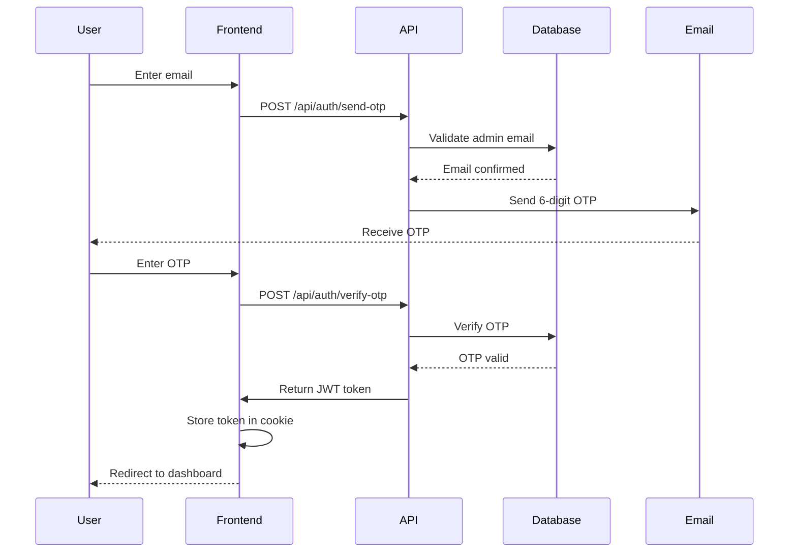

<div align="center">

# 🚀 Portfolio 2.0

### A Modern, Full-Stack Portfolio Experience

[](https://nextjs.org/)
[](https://www.typescriptlang.org/)
[](https://www.mongodb.com/)
[](https://tailwindcss.com/)

[Live Demo](https://your-portfolio-url.com) • [Report Bug](https://github.com/Aniruddha1701/Portfolio-2.0/issues) • [Request Feature](https://github.com/Aniruddha1701/Portfolio-2.0/issues)


</div>

---

## 📑 Table of Contents

- [Overview](#-overview)
- [Features](#-features)
- [Tech Stack](#-tech-stack)
- [Screenshots](#-screenshots)
- [Getting Started](#-getting-started)
- [Project Structure](#-project-structure)
- [Admin Dashboard](#-admin-dashboard)
- [API Reference](#-api-reference)
- [Deployment](#-deployment)
- [Performance](#-performance)
- [Contributing](#-contributing)
- [License](#-license)
- [Contact](#-contact)

---

## 🌟 Overview

**Portfolio 2.0** is a cutting-edge, full-stack portfolio application designed to showcase professional work, skills, and projects with style and sophistication. Built with modern web technologies, it features a secure admin dashboard, AI-powered content modules, stunning animations, and a polished, responsive user interface.

### ✨ What Makes This Special?

```yaml
🎨 Modern Design:      Dark/Light themes • Smooth animations • Glassmorphism
🤖 AI-Powered:         Gemini integration • Smart news aggregator • Content curation
🔐 Secure:             JWT authentication • OTP verification • Rate limiting
⚡ High Performance:   PWA support • SSR • Optimized images • SEO ready
📱 Responsive:         Mobile-first design • Works on all devices
🎮 Interactive:        Terminal CLI • Brain teasers • Dynamic playground
```

---

## 🎯 Features

```mermaid
graph TD
    A[Portfolio 2.0] --> B[Frontend Excellence]
    A --> C[Backend Power]
    A --> D[Admin Control]
    A --> E[AI Intelligence]
    
    B --> B1[Next.js 15 + React]
    B --> B2[Tailwind CSS + Shadcn]
    B --> B3[Framer Motion]
    B --> B4[PWA Support]
    
    C --> C1[MongoDB Atlas]
    C --> C2[RESTful API]
    C --> C3[Email Service]
    C --> C4[File Upload]
    
    D --> D1[OTP Authentication]
    D --> D2[Content Management]
    D --> D3[CRUD Operations]
    D --> D4[Analytics Dashboard]
    
    E --> E1[Google Gemini]
    E --> E2[News Aggregation]
    E --> E3[Smart Lab]
    E --> E4[Content Generation]
    
    style A fill:#4f46e5,stroke:#3730a3,stroke-width:3px,color:#fff
    style B fill:#ec4899,stroke:#db2777,stroke-width:2px,color:#fff
    style C fill:#8b5cf6,stroke:#7c3aed,stroke-width:2px,color:#fff
    style D fill:#06b6d4,stroke:#0891b2,stroke-width:2px,color:#fff
    style E fill:#10b981,stroke:#059669,stroke-width:2px,color:#fff
```

<div align="center">



</div>

### 🎨 Core Features

<table>
<tr>
<td width="50%">

#### 🖥️ User Experience
- ✅ **Fully Responsive Design** - Perfect on mobile, tablet, desktop
- 🌓 **Theme Toggle** - Dark/Light mode with system preference
- 🎨 **Stunning Animations** - Framer Motion transitions
- 🎆 **Particle Effects** - Interactive backgrounds
- 🖱️ **Custom Cursor** - Enhanced user interaction
- 💫 **Spotlight Effect** - Dynamic visual elements
- 📱 **PWA Ready** - Install as native app

</td>
<td width="50%">

#### 🔧 Technical Features
- 📊 **Dynamic Content** - MongoDB-powered CMS
- 🔍 **SEO Optimized** - Meta tags & sitemap
- 📧 **Contact Form** - Email integration
- 🔒 **Secure Auth** - JWT + OTP verification
- ⚡ **Performance** - Optimized images & lazy loading
- 🕹️ **Interactive Terminal** - CLI navigation
- 🧠 **Brain Teasers** - Wordle clone & games

</td>
</tr>
</table>

### 📦 Portfolio Sections

| Section | Description | Key Features |
|---------|-------------|--------------|
| 🏠 **Hero** | Animated introduction | Particle background, typing effect, social links |
| 👤 **About** | Professional journey | Timeline, education, experience milestones |
| 💼 **Skills** | Technical proficiencies | Categorized skills with proficiency meters |
| 🚀 **Projects** | Portfolio showcase | Live demos, GitHub links, tech stack tags |
| 💻 **Terminal** | Developer interface | CLI commands, easter eggs, navigation |
| 🎮 **Playground** | Interactive demos | UI components, logic games, experiments |
| 🏆 **Certifications** | Professional achievements | Certification cards with verification links |
| 🧪 **Smart Lab** | AI-powered news | Real-time IT news with Gemini curation |
| 📬 **Contact** | Get in touch | Form validation, email service, social links |
| 🔐 **Admin** | Content management | Glassmorphism dashboard, full CRUD |

---

## 🛠️ Tech Stack

### Frontend Technologies

<div align="center">

| Technology | Purpose | Version |
|------------|---------|---------|
|  | React Framework | 15.3.3 |
|  | Type Safety | 5.x |
|  | Styling | 3.x |
|  | Animations | Latest |
|  | UI Components | Latest |
|  | UI Library | 19.x |

</div>

### Backend & Infrastructure

<div align="center">

| Technology | Purpose | Details |
|------------|---------|---------|
|  | Database | Atlas/Local |
|  | ODM | Latest |
|  | Authentication | Token-based |
|  | Email Service | SMTP |
|  | Validation | Schema validation |

</div>

### AI & Integrations

<div align="center">

| Service | Purpose | Status |
|---------|---------|--------|
|  | AI Content | Optional |
|  | AI Flows | Optional |

</div>

---

## 📸 Screenshots

<div align="center">

### 🏠 Hero Section


*Dynamic particle background with animated introduction and social links*

---

### 🚀 Projects Showcase


*Interactive project cards with live demos and GitHub integration*

---

### 🔐 Admin Dashboard


*Glassmorphism design with comprehensive content management*

---

### 🧪 AI Smart Lab


*Real-time AI-curated IT news and insights*

</div>

---

## 🚀 Getting Started

### Prerequisites

Before you begin, ensure you have the following installed:

```bash
✅ Node.js >= 18.0.0
✅ npm or yarn
✅ MongoDB (Local or Atlas)
✅ Git
```

**Additional Requirements:**
- Gmail account (for SMTP email service)
- Google AI API key (optional, for AI features)

### Installation

Follow these steps to set up the project locally:

#### 1️⃣ Clone the Repository

```bash
git clone https://github.com/Aniruddha1701/Portfolio-2.0.git
cd Portfolio-2.0
```

#### 2️⃣ Install Dependencies

```bash
npm install
# or
yarn install
```

#### 3️⃣ Environment Configuration

Create a `.env.local` file in the root directory:

```bash
cp .env.example .env.local
```

Edit `.env.local` with your credentials:

```env
# ==========================================
# DATABASE CONFIGURATION
# ==========================================
MONGODB_URI=mongodb://localhost:27017/portfolio
# For MongoDB Atlas: mongodb+srv://<username>:<password>@cluster.mongodb.net/portfolio

# ==========================================
# EMAIL CONFIGURATION (Gmail SMTP)
# ==========================================
EMAIL_HOST=smtp.gmail.com
EMAIL_PORT=587
EMAIL_USER=your-email@gmail.com
EMAIL_PASS=your-app-password
EMAIL_FROM=your-email@gmail.com
EMAIL_TO=recipient@gmail.com

# ==========================================
# SECURITY
# ==========================================
JWT_SECRET=your-super-secret-jwt-key-minimum-32-characters
# Generate a secure key: openssl rand -base64 32

# ==========================================
# AI FEATURES (Optional)
# ==========================================
GOOGLE_API_KEY=your-google-ai-api-key
# Get your key: https://ai.google.dev/

# ==========================================
# APPLICATION
# ==========================================
NEXT_PUBLIC_URL=http://localhost:9002
NODE_ENV=development
```

<details>
<summary>📧 How to Get Gmail App Password</summary>

1. Go to [Google Account Settings](https://myaccount.google.com/)
2. Navigate to **Security** → **2-Step Verification**
3. Scroll down to **App passwords**
4. Click **Select app** → Choose "Mail"
5. Click **Select device** → Choose "Other" → Enter "Portfolio"
6. Click **Generate**
7. Copy the 16-character password and use it in `EMAIL_PASS`

</details>

#### 4️⃣ Initialize Database

Create the admin user:

```bash
node scripts/ensure-admin.js
```

**Default admin credentials:**
- Email: `admin@example.com`
- You'll set password via OTP on first login

Optional: Add sample data

```bash
# Add sample education data
node scripts/add-education-data.js

# Add sample certifications
node scripts/add-certifications.js

# Add user data
node scripts/add-user-data.js
```

#### 5️⃣ Start Development Server

```bash
npm run dev
# or
yarn dev
```

🎉 **Success!** Open [http://localhost:9002](http://localhost:9002) in your browser.

---

## 📁 Project Structure

```
Portfolio-2.0/
│
├── 📂 src/
│   ├── 📂 app/                      # Next.js App Router
│   │   ├── 📂 admin/                # Admin dashboard pages
│   │   │   ├── login/               # Admin login
│   │   │   ├── dashboard/           # Main dashboard
│   │   │   └── layout.tsx           # Admin layout
│   │   │
│   │   ├── 📂 api/                  # API Routes
│   │   │   ├── auth/                # Authentication endpoints
│   │   │   ├── portfolio/           # Portfolio data
│   │   │   ├── contact/             # Contact form
│   │   │   └── admin/               # Admin operations
│   │   │
│   │   ├── actions.ts               # Server actions
│   │   ├── layout.tsx               # Root layout
│   │   ├── page.tsx                 # Home page
│   │   └── globals.css              # Global styles
│   │
│   ├── 📂 components/               # React Components
│   │   ├── 📂 ui/                   # Shadcn UI components
│   │   │   ├── button.tsx
│   │   │   ├── card.tsx
│   │   │   ├── dialog.tsx
│   │   │   └── ...
│   │   │
│   │   ├── hero-enhanced.tsx        # Hero section
│   │   ├── about.tsx                # About section
│   │   ├── skills.tsx               # Skills display
│   │   ├── portfolio.tsx            # Projects showcase
│   │   ├── terminal.tsx             # Interactive terminal
│   │   ├── smart-lab.tsx            # AI news aggregator
│   │   ├── contact.tsx              # Contact form
│   │   ├── particles-background.tsx # Particle effects
│   │   ├── floating-orbs.tsx        # Floating animations
│   │   ├── cursor-follower.tsx      # Custom cursor
│   │   └── spotlight.tsx            # Spotlight effect
│   │
│   ├── 📂 lib/                      # Utilities & Services
│   │   ├── 📂 db/                   # Database utilities
│   │   │   ├── connection.ts        # MongoDB connection
│   │   │   └── index.ts
│   │   │
│   │   ├── email.ts                 # Email service (Nodemailer)
│   │   ├── session.ts               # Session management (JWT)
│   │   ├── rate-limit.ts            # Rate limiting
│   │   ├── utils.ts                 # Helper functions
│   │   └── validations.ts           # Zod schemas
│   │
│   ├── 📂 models/                   # Mongoose Models
│   │   ├── Admin.ts                 # Admin user model
│   │   ├── Contact.ts               # Contact form model
│   │   ├── Portfolio.ts             # Portfolio data model
│   │   └── OTP.ts                   # OTP verification model
│   │
│   ├── 📂 ai/                       # AI Integration
│   │   ├── 📂 flows/                # Genkit flows
│   │   │   ├── news-aggregator.ts
│   │   │   └── content-generator.ts
│   │   └── genkit.ts                # AI configuration
│   │
│   └── 📂 types/                    # TypeScript types
│       └── index.ts
│
├── 📂 public/                       # Static Assets
│   ├── images/                      # Images
│   ├── icons/                       # Icons
│   ├── resume/                      # Resume files
│   ├── preview.png                  # Preview image
│   ├── favicon.ico
│   └── manifest.json                # PWA manifest
│
├── 📂 scripts/                      # Database Scripts
│   ├── ensure-admin.js              # Create admin user
│   ├── reset-admin.js               # Reset admin password
│   ├── add-user-data.js             # Add sample data
│   ├── add-education-data.js        # Add education
│   ├── add-certifications.js        # Add certifications
│   └── update-education-experience.js
│
├── 📂 docs/                         # Documentation
│   ├── screenshots/                 # App screenshots
│   ├── DEPLOYMENT_FIX.md           # Deployment guide
│   └── VERCEL_DEPLOYMENT_GUIDE.md  # Vercel guide
│
├── .env.local                       # Environment variables (ignored)
├── .env.example                     # Environment template
├── .gitignore                       # Git ignore rules
├── next.config.ts                   # Next.js configuration
├── tailwind.config.ts               # Tailwind configuration
├── tsconfig.json                    # TypeScript configuration
├── package.json                     # Dependencies
├── package-lock.json
├── README.md                        # This file
└── LICENSE                          # MIT License
```

---

## 🔐 Admin Dashboard

The admin dashboard provides complete control over portfolio content with a beautiful glassmorphism design.

### 🔑 Access & Authentication

**URL:** `http://localhost:9002/admin/login`

**Authentication Flow:**



### 📊 Dashboard Features

<table>
<tr>
<td width="50%">

#### 👤 Personal Information
- ✏️ Edit name & professional title
- 📝 Update bio and tagline
- 📍 Set location
- 🔗 Manage social media links
- 🖼️ Upload profile picture
- 📄 Upload resume (PDF)

</td>
<td width="50%">

#### 💼 Content Management
- 🎯 Skills CRUD (categories & proficiency)
- 🚀 Projects management (with images)
- 📚 Education timeline
- 💼 Work experience
- 🏆 Certifications
- 📧 View contact form submissions

</td>
</tr>
</table>

### 🎨 Dashboard Sections

| Section | Description | Features |
|---------|-------------|----------|
| **Overview** | Quick stats & analytics | Message count, project count, skill count |
| **Personal Info** | Profile management | All personal data in one place |
| **Skills** | Technical skills | Add/Edit/Delete with proficiency levels |
| **Projects** | Portfolio projects | Full CRUD with image upload |
| **Journey** | Education & Experience | Timeline management |
| **Certifications** | Professional certs | Badge upload & verification links |
| **Messages** | Contact submissions | View & manage inquiries |
| **Settings** | Account settings | Theme, notifications, security |

### 🔒 Security Features

- ✅ **OTP Verification** - 6-digit code via email
- ✅ **JWT Tokens** - Secure session management
- ✅ **Rate Limiting** - Prevent brute force attacks
- ✅ **Input Validation** - Zod schema validation
- ✅ **CSRF Protection** - Token-based protection
- ✅ **Secure Headers** - XSS, clickjacking prevention

---

## 🔌 API Reference

### Authentication Endpoints

#### Send OTP

```http
POST /api/auth/send-otp
Content-Type: application/json

{
  "email": "admin@example.com"
}
```

**Response:**
```json
{
  "success": true,
  "message": "OTP sent to your email"
}
```

#### Verify OTP

```http
POST /api/auth/verify-otp
Content-Type: application/json

{
  "email": "admin@example.com",
  "otp": "123456"
}
```

**Response:**
```json
{
  "success": true,
  "token": "eyJhbGciOiJIUzI1NiIsInR5cCI6IkpXVCJ9...",
  "message": "Login successful"
}
```

#### Logout

```http
POST /api/auth/logout
Authorization: Bearer <token>
```

**Response:**
```json
{
  "success": true,
  "message": "Logged out successfully"
}
```

---

### Portfolio Endpoints

#### Get Portfolio Data

```http
GET /api/portfolio
```

**Response:**
```json
{
  "success": true,
  "data": {
    "personalInfo": { ... },
    "skills": [ ... ],
    "projects": [ ... ],
    "education": [ ... ],
    "experience": [ ... ],
    "certifications": [ ... ]
  }
}
```

#### Update Portfolio (Admin)

```http
POST /api/admin/portfolio
Authorization: Bearer <token>
Content-Type: application/json

{
  "personalInfo": {
    "name": "Your Name",
    "title": "Full Stack Developer",
    "bio": "Passionate developer...",
    "location": "City, Country",
    "social": { ... }
  }
}
```

#### Upload Image (Admin)

```http
POST /api/admin/upload-image
Authorization: Bearer <token>
Content-Type: multipart/form-data

{
  "file": <image-file>
}
```

**Response:**
```json
{
  "success": true,
  "url": "/images/uploads/filename.jpg"
}
```

#### Upload Resume (Admin)

```http
POST /api/admin/upload-resume
Authorization: Bearer <token>
Content-Type: multipart/form-data

{
  "file": <pdf-file>
}
```

---

### Contact Endpoint

#### Submit Contact Form

```http
POST /api/contact
Content-Type: application/json

{
  "name": "John Doe",
  "email": "john@example.com",
  "subject": "Inquiry",
  "message": "Hello, I'm interested in..."
}
```

**Response:**
```json
{
  "success": true,
  "message": "Message sent successfully"
}
```

---

### Complete API Endpoints Table

| Endpoint | Method | Auth | Description |
|----------|--------|------|-------------|
| `/api/auth/send-otp` | POST | ❌ | Send OTP to email |
| `/api/auth/verify-otp` | POST | ❌ | Verify OTP & login |
| `/api/auth/logout` | POST | ✅ | Logout user |
| `/api/portfolio` | GET | ❌ | Get portfolio data |
| `/api/admin/portfolio` | GET | ✅ | Get admin portfolio |
| `/api/admin/portfolio` | POST | ✅ | Update portfolio |
| `/api/admin/skills` | POST | ✅ | Add skill |
| `/api/admin/skills/:id` | PUT | ✅ | Update skill |
| `/api/admin/skills/:id` | DELETE | ✅ | Delete skill |
| `/api/admin/projects` | POST | ✅ | Add project |
| `/api/admin/projects/:id` | PUT | ✅ | Update project |
| `/api/admin/projects/:id` | DELETE | ✅ | Delete project |
| `/api/admin/upload-image` | POST | ✅ | Upload image |
| `/api/admin/upload-resume` | POST | ✅ | Upload resume |
| `/api/contact` | POST | ❌ | Submit contact form |
| `/api/admin/contacts` | GET | ✅ | Get all contacts |

---

## 🚢 Deployment

### Vercel (Recommended)

Vercel is the recommended platform for deploying Next.js applications.

#### Quick Deploy

[](https://vercel.com/new/clone?repository-url=https://github.com/Aniruddha1701/Portfolio-2.0)

#### Manual Deployment

1. **Push to GitHub**

```bash
git add .
git commit -m "Ready for deployment"
git push origin main
```

2. **Import Project in Vercel**

- Go to [vercel.com](https://vercel.com)
- Click "New Project"
- Import your GitHub repository
- Configure project settings

3. **Add Environment Variables**

Add all variables from `.env.local`:

```
MONGODB_URI
EMAIL_HOST
EMAIL_PORT
EMAIL_USER
EMAIL_PASS
EMAIL_FROM
EMAIL_TO
JWT_SECRET
GOOGLE_API_KEY (optional)
NEXT_PUBLIC_URL
```

4. **Deploy** 🚀

Click "Deploy" and wait for the build to complete.

#### Post-Deployment

1. Update `NEXT_PUBLIC_URL` with your Vercel URL
2. Configure custom domain (optional)
3. Set up MongoDB Atlas connection
4. Test admin login and all features

---

### Docker Deployment

#### Build Docker Image

```dockerfile
FROM node:18-alpine

WORKDIR /app

# Copy package files
COPY package*.json ./

# Install dependencies
RUN npm ci --only=production

# Copy application code
COPY . .

# Build application
RUN npm run build

# Expose port
EXPOSE 3000

# Set environment
ENV NODE_ENV=production

# Start application
CMD ["npm", "start"]
```

#### Build and Run

```bash
# Build image
docker build -t portfolio-2.0 .

# Run container
docker run -p 3000:3000 --env-file .env.local portfolio-2.0
```

#### Docker Compose

```yaml
version: '3.8'

services:
  app:
    build: .
    ports:
      - "3000:3000"
    env_file:
      - .env.local
    depends_on:
      - mongodb
    restart: unless-stopped

  mongodb:
    image: mongo:latest
    ports:
      - "27017:27017"
    volumes:
      - mongodb_data:/data/db
    restart: unless-stopped

volumes:
  mongodb_data:
```

Run with:

```bash
docker-compose up -d
```

---

### Other Platforms

<details>
<summary>Netlify</summary>

1. Connect GitHub repository
2. Set build command: `npm run build`
3. Set publish directory: `.next`
4. Add environment variables
5. Deploy

</details>

<details>
<summary>Railway</summary>

1. Connect GitHub repository
2. Add environment variables
3. Railway will auto-detect Next.js
4. Deploy

</details>

<details>
<summary>DigitalOcean</summary>

1. Create a Droplet
2. Install Node.js and MongoDB
3. Clone repository
4. Set up environment variables
5. Use PM2 for process management
6. Configure nginx as reverse proxy

</details>

---

## 📊 Performance

### Lighthouse Scores

<div align="center">

| Metric | Score | Description |
|--------|-------|-------------|
| ⚡ **Performance** | 95+ | Fast load times, optimized assets |
| ♿ **Accessibility** | 100 | WCAG 2.1 compliant |
| 🎯 **Best Practices** | 100 | Security, HTTPS, modern standards |
| 🔍 **SEO** | 100 | Meta tags, semantic HTML, sitemap |

</div>

### Optimization Techniques

✅ **Image Optimization**
- Next.js Image component
- WebP format with fallbacks
- Lazy loading
- Responsive images

✅ **Code Splitting**
- Dynamic imports
- Route-based splitting
- Component lazy loading

✅ **Caching Strategy**
- Static asset caching
- API response caching
- Browser caching headers

✅ **Performance Monitoring**
- Core Web Vitals tracking
- Real User Monitoring (RUM)
- Error tracking

---

## 📝 Scripts Reference

### Development

```bash
# Start development server (port 9002)
npm run dev

# Build for production
npm run build

# Start production server
npm start

# Run linting
npm run lint

# Fix linting issues
npm run lint:fix

# Type checking
npm run type-check
```

### Database Operations

```bash
# Create admin user
node scripts/ensure-admin.js

# Reset admin password
node scripts/reset-admin.js

# Add sample user data
node scripts/add-user-data.js

# Add education data
node scripts/add-education-data.js

# Add certifications
node scripts/add-certifications.js

# Update education and experience
node scripts/update-education-experience.js
```

### Utilities

```bash
# Clear Next.js cache
npm run clean

# Analyze bundle size
npm run analyze

# Check for outdated packages
npm outdated

# Update dependencies
npm update
```

---

## 🎨 Customization

### Theme Colors

Edit `src/app/globals.css`:

```css
:root {
  /* Primary Colors */
  --primary: 182 100% 74%;           /* Electric Blue */
  --primary-foreground: 0 0% 100%;   /* White */
  
  /* Accent Colors */
  --accent: 120 75% 55%;             /* Lime Green */
  --accent-foreground: 0 0% 0%;      /* Black */
  
  /* Background */
  --background: 0 0% 100%;           /* White */
  --foreground: 0 0% 3.9%;           /* Almost Black */
  
  /* Muted */
  --muted: 0 0% 96.1%;
  --muted-foreground: 0 0% 45.1%;
  
  /* Card */
  --card: 0 0% 100%;
  --card-foreground: 0 0% 3.9%;
  
  /* Border */
  --border: 0 0% 89.8%;
  --input: 0 0% 89.8%;
  --ring: 182 100% 74%;
}

.dark {
  --background: 0 0% 3.9%;           /* Almost Black */
  --foreground: 0 0% 98%;            /* Almost White */
  
  --card: 0 0% 3.9%;
  --card-foreground: 0 0% 98%;
  
  --muted: 0 0% 14.9%;
  --muted-foreground: 0 0% 63.9%;
  
  --border: 0 0% 14.9%;
  --input: 0 0% 14.9%;
}
```

### Animation Customization

#### Particle Background

Edit `src/components/particles-background.tsx`:

```typescript
// Particle count
const particleCount = 50; // Increase for more particles

// Particle colors
const colors = ['#60A5FA', '#34D399', '#F472B6']; // Add your colors

// Animation speed
const animationDuration = 20; // Seconds
```

#### Floating Orbs

Edit `src/components/floating-orbs.tsx`:

```typescript
// Number of orbs
const orbCount = 5;

// Orb sizes
const sizes = [400, 300, 500]; // Pixels

// Orb colors
const colors = {
  primary: 'rgba(96, 165, 250, 0.3)',
  secondary: 'rgba(52, 211, 153, 0.3)',
  accent: 'rgba(244, 114, 182, 0.3)',
};
```

### Component Styling

All components use Tailwind CSS. To customize:

1. Edit component files in `src/components/`
2. Modify Tailwind classes
3. Add custom CSS in component styles
4. Update `tailwind.config.ts` for global changes

---

## 🤝 Contributing

Contributions are welcome! Here's how you can help:

### Getting Started

1. **Fork the Repository**

Click the "Fork" button at the top right of this page.

2. **Clone Your Fork**

```bash
git clone https://github.com/YOUR_USERNAME/Portfolio-2.0.git
cd Portfolio-2.0
```

3. **Create a Branch**

```bash
git checkout -b feature/amazing-feature
```

4. **Make Your Changes**

- Write clean, documented code
- Follow the existing code style
- Add tests if applicable
- Update documentation

5. **Commit Changes**

```bash
git add .
git commit -m "Add amazing feature"
```

Follow [Conventional Commits](https://www.conventionalcommits.org/):

```
feat: Add new feature
fix: Bug fix
docs: Documentation update
style: Code style change
refactor: Code refactoring
test: Add tests
chore: Maintenance
```

6. **Push to Your Fork**

```bash
git push origin feature/amazing-feature
```

7. **Open a Pull Request**

- Go to the original repository
- Click "New Pull Request"
- Select your fork and branch
- Describe your changes
- Submit!

### Contribution Guidelines

- ✅ Write clear commit messages
- ✅ Update documentation
- ✅ Add comments to complex code
- ✅ Test your changes thoroughly
- ✅ Follow TypeScript best practices
- ✅ Maintain consistent code style
- ✅ Be respectful and constructive

### Areas for Contribution

- 🐛 Bug fixes
- ✨ New features
- 📝 Documentation improvements
- 🎨 UI/UX enhancements
- ♿ Accessibility improvements
- 🌍 Internationalization
- 🧪 Testing
- ⚡ Performance optimization

---

## 📄 License

This project is licensed under the **MIT License**.

### MIT License

```
MIT License

Copyright (c) 2026 Aniruddha

Permission is hereby granted, free of charge, to any person obtaining a copy
of this software and associated documentation files (the "Software"), to deal
in the Software without restriction, including without limitation the rights
to use, copy, modify, merge, publish, distribute, sublicense, and/or sell
copies of the Software, and to permit persons to whom the Software is
furnished to do so, subject to the following conditions:

The above copyright notice and this permission notice shall be included in all
copies or substantial portions of the Software.

THE SOFTWARE IS PROVIDED "AS IS", WITHOUT WARRANTY OF ANY KIND, EXPRESS OR
IMPLIED, INCLUDING BUT NOT LIMITED TO THE WARRANTIES OF MERCHANTABILITY,
FITNESS FOR A PARTICULAR PURPOSE AND NONINFRINGEMENT. IN NO EVENT SHALL THE
AUTHORS OR COPYRIGHT HOLDERS BE LIABLE FOR ANY CLAIM, DAMAGES OR OTHER
LIABILITY, WHETHER IN AN ACTION OF CONTRACT, TORT OR OTHERWISE, ARISING FROM,
OUT OF OR IN CONNECTION WITH THE SOFTWARE OR THE USE OR OTHER DEALINGS IN THE
SOFTWARE.
```

See the [LICENSE](LICENSE) file for the full license text.

---

## 🙏 Acknowledgments

This project was built with amazing open-source technologies:

<div align="center">

### 💙 Special Thanks To

[](https://nextjs.org/)
[](https://reactjs.org/)
[](https://www.typescriptlang.org/)
[](https://tailwindcss.com/)
[](https://www.mongodb.com/)
[](https://www.framer.com/motion/)
[](https://ui.shadcn.com/)

### 🌟 Inspiration & Resources

- [Next.js Documentation](https://nextjs.org/docs)
- [Tailwind CSS Documentation](https://tailwindcss.com/docs)
- [MongoDB Documentation](https://docs.mongodb.com/)
- [Framer Motion Documentation](https://www.framer.com/motion/)
- [Shadcn/ui Components](https://ui.shadcn.com/)
- [Google Gemini AI](https://ai.google.dev/)
- [Vercel](https://vercel.com/) - Hosting Platform

</div>

---

## 📞 Contact

<div align="center">

### Questions? Suggestions? Let's Connect!

[](https://github.com/Aniruddha1701)
[](https://linkedin.com/in/yourprofile)
[](mailto:your-email@example.com)
[](https://your-portfolio-url.com)

</div>

### 💬 Support & Feedback

- 🐛 **Found a bug?** [Open an issue](https://github.com/Aniruddha1701/Portfolio-2.0/issues/new?template=bug_report.md)
- 💡 **Have a feature request?** [Suggest a feature](https://github.com/Aniruddha1701/Portfolio-2.0/issues/new?template=feature_request.md)
- ❓ **Need help?** [Start a discussion](https://github.com/Aniruddha1701/Portfolio-2.0/discussions)
- 📧 **Direct contact?** [Send an email](mailto:your-email@example.com)

---

<div align="center">

### ⭐ Star this repository if you find it helpful!

**Made with ❤️ by [Aniruddha](https://github.com/Aniruddha1701)**


### 🚀 Happy Coding!

</div>
