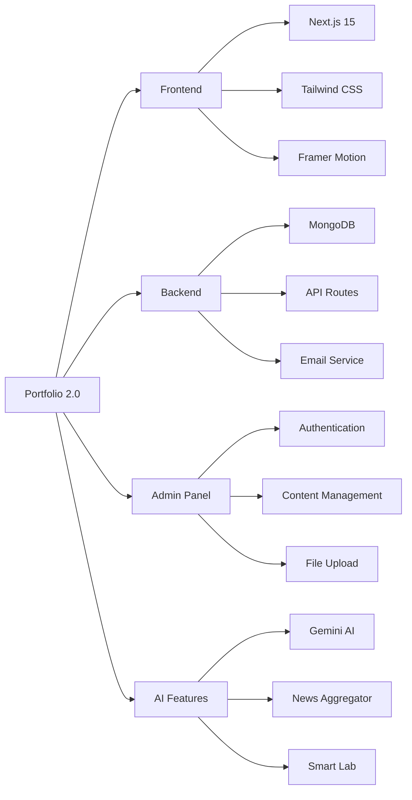
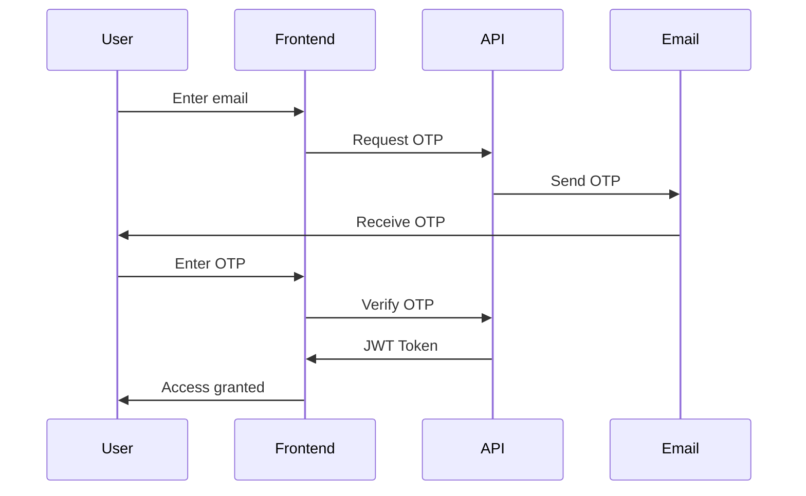

<div align="center">

<!-- Animated Header -->


<p align="center">
  
</p>

<!-- Badges with Animation -->
<p align="center">
  <a href="https://nextjs.org/">
    
  </a>
  <a href="https://www.typescriptlang.org/">
    
  </a>
  <a href="https://www.mongodb.com/">
    
  </a>
  <a href="https://tailwindcss.com/">
    
  </a>
</p>

<!-- Action Buttons -->
<p align="center">
  <a href="https://your-portfolio-url.com">
    
  </a>
  <a href="https://github.com/Aniruddha1701/Portfolio-2.0/issues">
    
  </a>
  <a href="https://github.com/Aniruddha1701/Portfolio-2.0/issues">
    
  </a>
</p>

<!-- Stats -->
<p align="center">
  
  
  
</p>

</div>

---

<div align="center">

## 📸 Preview


### 🌟 Live Application Screenshots

<table>
  <tr>
    <td></td>
    <td></td>
  </tr>
  <tr>
    <td align="center"><b>🏠 Hero Section</b></td>
    <td align="center"><b>🚀 Projects Showcase</b></td>
  </tr>
  <tr>
    <td></td>
    <td></td>
  </tr>
  <tr>
    <td align="center"><b>🔐 Admin Dashboard</b></td>
    <td align="center"><b>🧪 AI Smart Lab</b></td>
  </tr>
</table>


</div>

<div align="center">

## ✨ Highlights


</div>

<table>
<tr>
<td width="50%" align="center">


### 🎨 **Modern Design**

```yaml
✨ Stunning dark/light mode
🌊 Smooth animations with Framer Motion
🎆 Interactive particle backgrounds
📱 Responsive across all devices
```

</td>
<td width="50%" align="center">


### 🤖 **AI-Powered**

```yaml
🧠 Google Gemini AI integration
📰 Smart IT news aggregator
🎯 Intelligent content curation
⚡ Real-time updates
```

</td>
</tr>
<tr>
<td width="50%" align="center">


### 🔐 **Secure Admin Panel**

```yaml
📧 Email OTP authentication
🔑 JWT-based sessions
⚙️ Full CRUD operations
📁 Image & resume upload
```

</td>
<td width="50%" align="center">


### ⚡ **Performance**

```yaml
📱 PWA support
🖼️ Optimized images
🚀 Server-side rendering
🔍 SEO optimized
```

</td>
</tr>
</table>

<div align="center">

</div>

---

## 🎯 Features



### 🌟 Core Features

- ✅ **Fully Responsive** - Perfect on mobile, tablet, and desktop
- 🌓 **Theme Toggle** - Dark/Light mode with system preference
- 📊 **Dynamic Content** - MongoDB-powered content management
- 📱 **PWA Ready** - Install as a native app
- 🔍 **SEO Optimized** - Dynamic metadata for better rankings
- 📧 **Contact Form** - Email integration with validation
- 🎨 **Animations** - Smooth transitions and effects
- 🔒 **Secure** - JWT authentication & rate limiting

### 📦 Portfolio Sections

| Section | Description |
|---------|-------------|
| 🏠 **Hero** | Animated introduction with personal branding |
| 👤 **About** | Journey timeline with education & experience |
| 💼 **Skills** | Categorized skills with proficiency levels |
| 🚀 **Projects** | Showcase with live demos & GitHub links |
| 🏆 **Certifications** | Professional achievements display |
| 🧪 **Smart Lab** | AI-powered IT news aggregator |
| 📬 **Contact** | Email-based contact system |

---

<div align="center">

## 🛠️ Tech Stack


### 🌈 Frontend Technologies

<p>
  
  
  
  
  
  
</p>

### 🔧 Backend & Database

<p>
  
  
  
  
  
</p>

### 🤖 AI & Integration

<p>
  
  
  
  
</p>


</div>

---

<div align="center">

## 🚀 Quick Start


</div>

### 📦 Prerequisites

<table>
<tr>
<td>

```yaml
✅ Node.js >= 18.0
✅ MongoDB (local or Atlas)
✅ Gmail account (for SMTP)
✅ Google AI API key (optional)
```

</td>
<td>

</td>
</tr>
</table>

### 🛠️ Installation

```bash
# 📥 1. Clone the repository
git clone https://github.com/Aniruddha1701/Portfolio-2.0.git
cd Portfolio-2.0

# 📦 2. Install dependencies
npm install

# ⚙️ 3. Set up environment variables
cp .env.example .env.local
# Edit .env.local with your credentials

# 💾 4. Initialize database
node scripts/ensure-admin.js

# 🚀 5. Run development server
npm run dev
```

<div align="center">

### 🎉 Open [http://localhost:9002](http://localhost:9002) in your browser!


</div>

---

## ⚙️ Environment Variables

Create a `.env.local` file in the root directory:

```env
# Database
MONGODB_URI=mongodb://localhost:27017/portfolio

# Email Configuration
EMAIL_HOST=smtp.gmail.com
EMAIL_PORT=587
EMAIL_USER=your-email@gmail.com
EMAIL_PASS=your-app-password

# Email Recipients
EMAIL_FROM=your-email@gmail.com
EMAIL_TO=recipient@gmail.com

# Security
JWT_SECRET=your-super-secret-jwt-key

# AI Features (Optional)
GOOGLE_API_KEY=your-google-ai-api-key

# Application
NEXT_PUBLIC_URL=http://localhost:9002
```

<details>
<summary>📧 How to get Gmail App Password</summary>

1. Go to [Google Account Settings](https://myaccount.google.com/)
2. Navigate to **Security** → **2-Step Verification**
3. Scroll to **App passwords**
4. Generate password for "Mail"
5. Use in `EMAIL_PASS`

</details>

---

## 📁 Project Structure

```
Portfolio-2.0/
├── 📂 src/
│   ├── 📂 app/                    # Next.js App Router
│   │   ├── 📂 admin/              # Admin dashboard
│   │   ├── 📂 api/                # API routes
│   │   ├── actions.ts             # Server actions
│   │   ├── layout.tsx             # Root layout
│   │   └── page.tsx               # Home page
│   ├── 📂 components/             # React components
│   │   ├── 📂 ui/                 # Shadcn components
│   │   ├── hero-enhanced.tsx      # Hero section
│   │   ├── skills.tsx             # Skills display
│   │   ├── portfolio.tsx          # Projects
│   │   └── smart-lab.tsx          # AI news
│   ├── 📂 lib/                    # Utilities
│   │   ├── 📂 db/                 # Database utils
│   │   ├── email.ts               # Email service
│   │   ├── session.ts             # Auth sessions
│   │   └── rate-limit.ts          # Rate limiting
│   ├── 📂 models/                 # Mongoose models
│   │   ├── Admin.ts
│   │   ├── Contact.ts
│   │   └── Portfolio.ts
│   └── 📂 ai/                     # AI integration
│       ├── 📂 flows/              # Genkit flows
│       └── genkit.ts              # AI config
├── 📂 public/                     # Static assets
├── 📂 scripts/                    # Database scripts
├── .env.local                     # Environment vars
├── next.config.ts                 # Next.js config
├── tailwind.config.ts             # Tailwind config
└── package.json                   # Dependencies
```

---

## 🎨 Admin Panel

Access at `/admin/login`

### Features

<table>
<tr>
<td width="33%">

#### 👤 Personal Info
- Name & title
- Bio & location
- Social links
- Profile picture

</td>
<td width="33%">

#### 💼 Content
- Skills management
- Projects CRUD
- Journey timeline
- Certifications

</td>
<td width="33%">

#### 📄 Files
- Image upload
- Resume upload
- File management
- Optimization

</td>
</tr>
</table>

### Authentication Flow



---

## 🔌 API Reference

### Authentication

| Endpoint | Method | Description |
|----------|--------|-------------|
| `/api/auth/send-otp` | POST | Send OTP to email |
| `/api/auth/verify-otp` | POST | Verify OTP & login |
| `/api/auth/logout` | POST | Logout user |

### Portfolio

| Endpoint | Method | Auth | Description |
|----------|--------|------|-------------|
| `/api/portfolio` | GET | ❌ | Get portfolio data |
| `/api/admin/portfolio` | POST | ✅ | Update portfolio |
| `/api/admin/upload-image` | POST | ✅ | Upload image |
| `/api/admin/upload-resume` | POST | ✅ | Upload resume |

### Contact

| Endpoint | Method | Description |
|----------|--------|-------------|
| `/api/contact` | POST | Submit contact form |

---

## 🚢 Deployment

### Vercel (Recommended)

[](https://vercel.com/new/clone?repository-url=https://github.com/Aniruddha1701/Portfolio-2.0)

1. Push to GitHub
2. Import in Vercel
3. Add environment variables
4. Deploy 🚀

### Docker

```dockerfile
FROM node:18-alpine
WORKDIR /app
COPY package*.json ./
RUN npm ci --only=production
COPY . .
RUN npm run build
EXPOSE 3000
CMD ["npm", "start"]
```

```bash
docker build -t portfolio .
docker run -p 3000:3000 portfolio
```

---

<div align="center">

## 📊 Performance Metrics


<table>
<tr>
<td align="center" width="25%">
<br>
<b>⚡ Performance</b><br>

</td>
<td align="center" width="25%">
<br>
<b>♿ Accessibility</b><br>

</td>
<td align="center" width="25%">
<br>
<b>🎯 Best Practices</b><br>

</td>
<td align="center" width="25%">
<br>
<b>🔍 SEO</b><br>

</td>
</tr>
</table>


</div>

---

## 🔒 Security

- ✅ JWT authentication
- ✅ Email OTP verification
- ✅ Rate limiting
- ✅ Input validation (Zod)
- ✅ CORS configuration
- ✅ Secure headers
- ✅ Environment variables
- ✅ XSS protection

---

## 🤝 Contributing

Contributions are welcome! Please follow these steps:

1. Fork the repository
2. Create feature branch (`git checkout -b feature/AmazingFeature`)
3. Commit changes (`git commit -m 'Add AmazingFeature'`)
4. Push to branch (`git push origin feature/AmazingFeature`)
5. Open Pull Request

---

## 📝 Scripts Reference

```bash
# Development
npm run dev              # Start dev server (port 9002)
npm run build           # Build for production
npm start              # Start production server
npm run lint           # Run ESLint

# Database
node scripts/ensure-admin.js                    # Create admin
node scripts/reset-admin.js                     # Reset password
node scripts/add-user-data.js                   # Add sample data
node scripts/add-education-data.js              # Add education
node scripts/add-certifications.js              # Add certs
node scripts/update-education-experience.js     # Update journey
```

---

## 🎨 Customization

### Theme Colors

Edit `src/app/globals.css`:

```css
:root {
  --primary: 182 100% 74%;    /* Electric Blue */
  --accent: 120 75% 55%;      /* Lime Green */
  --background: 0 0% 100%;    /* White */
  --foreground: 0 0% 3.9%;    /* Dark */
}

.dark {
  --background: 0 0% 3.9%;    /* Dark */
  --foreground: 0 0% 98%;     /* Light */
}
```

### Animations

Customize in `src/components/`:
- `particles-background.tsx` - Particle effects
- `floating-orbs.tsx` - Floating animations
- `cursor-follower.tsx` - Custom cursor
- `spotlight.tsx` - Spotlight effect

---

## 📄 License

This project is licensed under the MIT License - see the [LICENSE](LICENSE) file for details.

---

## 🙏 Acknowledgments

<div align="center">

Built with amazing technologies:

[Next.js](https://nextjs.org/) • [MongoDB](https://www.mongodb.com/) • [Tailwind CSS](https://tailwindcss.com/) • [Shadcn/ui](https://ui.shadcn.com/) • [Framer Motion](https://www.framer.com/motion/) • [Google Gemini](https://ai.google.dev/)

</div>

---

<div align="center">

## 📞 Contact & Support


<table>
<tr>
<td align="center" width="33%">
<br>
<b>Questions?</b><br>
<a href="https://github.com/Aniruddha1701/Portfolio-2.0/issues">

</a>
</td>
<td align="center" width="33%">
<br>
<b>Found a Bug?</b><br>
<a href="https://github.com/Aniruddha1701/Portfolio-2.0/issues">

</a>
</td>
<td align="center" width="33%">
<br>
<b>Need Support?</b><br>
<a href="mailto:your-email@gmail.com">

</a>
</td>
</tr>
</table>


### ⭐ Star this repo if you find it helpful!


**Made with ❤️ by [Aniruddha](https://github.com/Aniruddha1701)**


</div>
